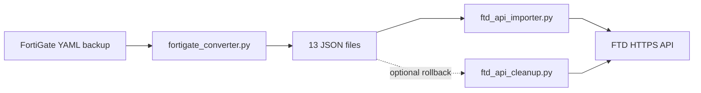
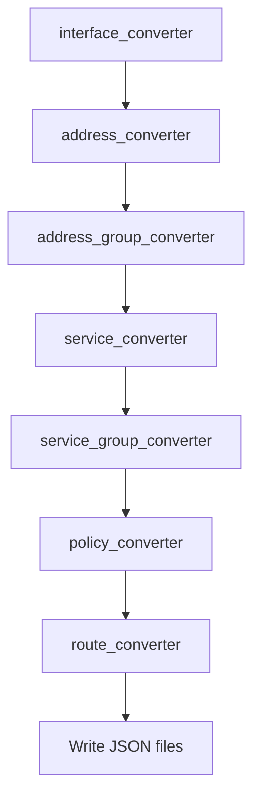

# FortiGate to Cisco FTD - Code Guide

This document explains how the Python code in `FortiGateToFTDTool/` works: architecture, data flow, key classes, and import behavior. It is intended for developers and reviewers who need to understand the implementation, not just the operator workflow in `README.md`.

**For a numbered step-by-step trace of execution** (what runs in what order, function by function), see **`FORTIGATE_TO_FTD_EXECUTION_WALKTHROUGH.md`**.

---

## Viewing the data flow diagram

The diagram below uses [Mermaid](https://mermaid.js.org/) syntax.

**Cursor / VS Code:** The built-in Markdown preview (`Ctrl+Shift+V`) does **not** render Mermaid unless you install an extension such as [Markdown Preview Mermaid Support](https://marketplace.visualstudio.com/items?itemName=bierner.markdown-mermaid). Without that, you will see a plain code block.

**Easiest local option:** Open **`docs/fortigate_to_ftd_flow.html`** in your browser (double-click or drag into Chrome/Edge). It renders the same diagram with no extensions.

**Other options:**

- **GitHub / GitLab** - Mermaid renders when viewing the `.md` file on the web
- **mermaid.live** - paste the diagram block, export PNG/SVG for Word/PDF
- **Confluence** - paste into a Mermaid macro

---

## End-to-end data flow



## Conversion module order

Inside `fortigate_converter.py`, modules run in this order. Each step passes mappings (interface names, service splits, group members) to later steps.



Cross-dependencies not shown as extra arrows: `route_converter` and `policy_converter` also consume interface and address mappings built earlier. See the **Conversion sequence** section below for detail.

**Three phases:**

| Phase | Entry point | Input | Output |
|-------|-------------|-------|--------|
| 1. Convert | `fortigate_converter.main()` | FortiGate YAML | JSON files on disk |
| 2. Import | `ftd_api_importer.main()` | JSON files | HTTPS calls to FTD |
| 3. Cleanup | `ftd_api_cleanup.main()` | (none - reads live FTD state) | Deletes objects on FTD |

The GUI (`gui_app.py`) calls the same `main()` functions in-process; it is not a separate code path.

---

## Directory layout and import model

All FTD tools live in `FortiGateToFTDTool/`. The repo does **not** use package imports like `from FortiGateToFTDTool.address_converter import ...`.

Instead, callers add the folder to `sys.path` and import modules directly:

```python
# gui_app.py (simplified)
sys.path.insert(0, "FortiGateToFTDTool")
from fortigate_converter import main as convert_main
from ftd_api_importer import main as import_main
```

Each converter module is a standalone file with one primary class (e.g. `AddressConverter`). Shared logic lives in `common.py`. API clients share `ftd_api_base.py`.

---

## Phase 1: Conversion - `fortigate_converter.py`

### Role

Orchestrator only. It does not contain FortiGate→FTD mapping rules. It:

1. Parses CLI arguments
2. Loads and cleans YAML
3. Instantiates converter classes in dependency order
4. Passes mappings between converters
5. Writes JSON output files

### `main(argv=None)` structure

`argv=None` allows the GUI to pass a synthetic argument list without touching `sys.argv`.

**Argument parsing** (`argparse`):

| Argument | Purpose |
|----------|---------|
| `input_file` | FortiGate YAML path (optional only with `--list-models`) |
| `-o / --output` | Base name for output files (default `ftd_config`) |
| `-p / --pretty` | Indent JSON for human review |
| `-m / --target-model` | FTD model for interface port mapping |
| `--ha-port` | Override HA port, or `none` to disable reservation |
| `--list-models` | Print `FTD_MODELS` table and exit |

**YAML loading - two-stage cleaning:**

1. **`preprocess_yaml_file()`** - line-oriented text filter. Removes entire YAML sections that break the parser or are irrelevant (DLP, automation triggers). Uses indentation tracking to skip nested lines under a bad section header.

2. **`yaml.safe_load()`** - parses cleaned text into a nested `dict`. A second pass deletes the same section keys from the dict if they survived preprocessing.

**Conversion sequence** (order is fixed in code):

```
InterfaceConverter.convert()
  → interface_results, interface_name_mapping

AddressConverter.convert()
  → network_objects

RouteConverter(...)  # constructed here; convert() called later

AddressGroupConverter.convert()
  → network_groups, address_groups set

ServiceConverter.convert()
  → port_objects, service_name_mapping, skipped_services

ServiceGroupConverter.set_split_services(...); .convert()
  → port_groups, service_groups set

PolicyConverter.set_split_services(...); .convert()
  → access_rules

RouteConverter.convert()
  → static_routes
```

**Why this order:** Routes and policies reference address names and interface names. Service groups and policies reference service names, including TCP/UDP splits produced by `ServiceConverter`.

**Metadata and output:**

- `build_conversion_metadata(args)` writes `{base}_metadata.json` with `target_model`, `output_basename`, `ha_port`, `schema_version`.
- Each object type gets its own JSON file (array of objects).
- `{base}_summary.json` holds conversion statistics.

Helper functions:

- `write_json_file(path, data, pretty)` - thin wrapper around `json.dump`.
- `preprocess_yaml_file()` - text-level YAML sanitizer.

---

## Shared utilities - `common.py`

Pure functions, no classes.

### `sanitize_name(name: str) -> str`

Replaces non-alphanumeric characters with `_`, collapses repeated underscores, strips edges. Every converter uses this so FortiGate object names become FTD-safe identifiers.

### `build_group_lookup(group_entries) -> Dict[str, List[str]]`

Parses FortiGate group sections (`firewall_addrgrp`, `firewall_service_group`) into `{sanitized_group_name: [member, ...]}`.

### `flatten_group_members(members, group_lookup, visited)`

Recursively expands nested groups into a flat member list. Detects circular references and skips with a warning.

Used by address and service group converters so FTD groups reference leaf objects, not nested FortiGate group names.

---

## Converter modules - common pattern

Each converter follows the same object-oriented pattern:

```python
class SomeConverter:
    def __init__(self, fortigate_config: dict, ...):
        self.fg_config = fortigate_config
        self.results = []

    def convert(self) -> List[Dict]:
        section = self.fg_config.get("firewall_...", [])
        for entry in section:
            name = list(entry.keys())[0]
            props = entry[name]
            ftd_obj = self._build_ftd_object(name, props)
            self.results.append(ftd_obj)
        return self.results
```

FortiGate YAML lists are modeled as `[{object_name: {properties}}]`. Converters peel off the name key, read properties, emit an FTD-shaped dict.

Some converters expose extra methods called by the orchestrator after `convert()`:

| Converter | Extra outputs |
|-----------|---------------|
| `InterfaceConverter` | `get_interface_mapping()`, `get_statistics()` |
| `ServiceConverter` | `get_service_name_mapping()`, `get_skipped_services()`, `get_statistics()` |
| `PolicyConverter` | `set_split_services(...)`, `get_statistics()` |
| `RouteConverter` | `get_statistics()` |

---

## `interface_converter.py` - interfaces and zones

Largest converter. Responsibilities:

1. **Model-aware port assignment** - `FTD_MODELS` dict defines `total_ports`, default `ha_port`, port prefix per model (`ftd-3120`, etc.).
2. **HA port reservation** - `--ha-port` or model default; excluded from data port pool.
3. **FortiGate type mapping:**

   | FortiGate | FTD API shape |
   |-----------|---------------|
   | `physical` | PUT payload for existing `physicalinterface` |
   | `aggregate` | POST `etherchannelinterface` |
   | `switch` | POST `bridgegroupinterface` |
   | VLAN (parent + `vlanid`) | POST `subinterface` |

4. **Security zones** - derived from interface/alias assignments for use in access rules.

Returns a dict with keys `physical_interfaces`, `etherchannels`, `bridge_groups`, `subinterfaces`, `security_zones`.

`get_interface_mapping()` returns `{fortigate_intf_name: ftd_intf_name}` used by `RouteConverter` and `PolicyConverter`.

---

## `address_converter.py`

Reads `firewall_address` from the config dict.

Determines FTD `subType`:

- Host (`/32` or single IP)
- Network (subnet → CIDR)
- Range (`start-ip` / `end-ip`)

Output shape:

```json
{
  "name": "sanitized_name",
  "type": "networkobject",
  "subType": "HOST|NETWORK|RANGE",
  "value": "10.0.0.0/24"
}
```

FQDN addresses are handled separately (domain string, not IP validation).

---

## `service_converter.py`

Reads `firewall_service_custom`.

Key behavior: **protocol splitting**. FortiGate allows one service with both TCP and UDP ports. FTD requires separate TCP and UDP port objects. One FortiGate service may become two FTD objects (`NAME_tcp`, `NAME_udp`).

`get_service_name_mapping()` returns:

```python
{"FortiGate_DNS": [("DNS_tcp", "tcpportobject"), ("DNS_udp", "udpportobject")]}
```

ICMP and port-less services are skipped and tracked in `skipped_services` so groups and policies do not reference them.

---

## `address_group_converter.py` / `service_group_converter.py`

Build group lookup tables, flatten members, emit FTD group objects with `objects` reference lists.

`ServiceGroupConverter.set_split_services()` must run before `convert()` so member names point at split TCP/UDP objects, not the original FortiGate name.

---

## `policy_converter.py`

Reads `firewall_policy`.

Mappings:

- `accept` → `PERMIT`, `deny` → `DENY`
- `srcintf` / `dstintf` → `sourceZones` / `destinationZones` (via interface mapping)
- `srcaddr` / `dstaddr` → network object references
- `service` → port object references (uses split service mapping)

`set_split_services()` injects address group names, service group names, and interface mapping from earlier conversion steps.

Rules get sequential `ruleId` values preserving FortiGate policy order.

---

## `route_converter.py`

Initialized **after** address objects exist but **converted after** policies (orchestrator calls `.convert()` last among object types).

Needs:

- `network_objects` - to resolve gateway/destination references
- `interface_name_mapping` - FortiGate interface → FTD interface
- `converted_interfaces` - physical/sub/etherchannel/bridge data for next-hop interface selection

Skips blackhole routes and routes that cannot be mapped.

---

## Phase 2: Import - `ftd_api_importer.py`

~3,400 lines. Split into:

1. **`FTDAPIClient`** class - API operations
2. **`import_*` functions** - one per JSON file type
3. **`main()`** - CLI, auth, orchestration

### Class hierarchy

```
FTDBaseClient          (ftd_api_base.py - auth, session, token refresh)
    └── FTDAPIClient   (importer - create/update, caches, stats)
```

`FTDBulkDelete` in `ftd_api_cleanup.py` also extends `FTDBaseClient`.

### `FTDBaseClient` - session and auth

- Builds `requests.Session` with `verify_ssl` flag (default off for self-signed mgmt certs).
- `base_url = f"https://{host}/api/fdm/latest"`
- **`authenticate()`** - POST `/fdm/token` with OAuth password grant; stores `access_token` / `refresh_token` in session headers.
- **`_auto_refresh_hook`** - registered on the session; on HTTP 401, refreshes token and retries the request once.
- **`validate_endpoints()`** - probes known REST paths before import.
- Error handling avoids printing raw `response.text` (FDM can echo submitted credentials).

### `FTDAPIClient` - import logic

**Caches** (populated before/during import):

```python
_physical_interface_cache   # hardwareName → {id, ...}
_etherchannel_cache
_bridge_group_cache
_security_zone_cache
_network_object_cache
```

Caches avoid repeated GETs when building reference objects for groups, routes, and rules.

**`create_network_object()` pattern** (representative of all create methods):

1. Check if object exists by name (GET collection, filter).
2. If exists and `update_existing` is True → `_update_existing_object()` (PUT with merged id/version).
3. If exists and payloads match → return `SKIPPED`.
4. If not exists → POST to collection endpoint.
5. On duplicate error with update enabled → fall back to PUT.

**`_payload_matches_existing()`** - compares value fields only, ignoring FDM metadata (`id`, `version`, `links`). Prevents unnecessary PUTs.

**Statistics** - thread-safe counters via `record_stat()` / `record_failure()`.

### `import_*` functions

Each function:

1. `load_json_file(filename)`
2. Loop objects (sequential or threaded)
3. Call client method wrapped in `run_with_retry()`
4. Print progress; update stats

**Threading:** `import_address_objects` and `import_service_objects` use `run_indexed_thread_pool()` from `concurrency_utils.py`. Other types run sequentially with optional `delay` between calls.

### `main()` import modes

| Mode | Trigger | Behavior |
|------|---------|----------|
| Full import | No `--only-*`, no `--file` | All 12 steps in dependency order |
| Selective | `--only-address-objects`, etc. | Single category from `{base}_*.json` |
| Single file | `--file` + `--type` | One JSON file, explicit type |

**Metadata:** Reads `{base}_metadata.json` (or `--metadata-file`) to set `client.appliance_model` for model-specific API behavior via `platform_profiles.py`.

**Full import order** (in code):

1. Physical interfaces (PUT)
2. Subinterfaces on physical parents
3. EtherChannels
4. Subinterfaces on etherchannel parents
5. Bridge groups
6. Security zones
7. Address objects (parallel)
8. Address groups
9. Service objects (parallel)
10. Service groups
11. Static routes
12. Access rules

Optional `--deploy` triggers FDM deployment after import.

---

## `concurrency_utils.py`

| Function | Purpose |
|----------|---------|
| `is_transient_api_error(msg)` | Detect 429, 503, 504, rate-limit text |
| `run_with_retry(op, max_attempts, backoff, jitter)` | Exponential backoff retry wrapper |
| `run_indexed_thread_pool(workers, items, worker)` | Bounded `ThreadPoolExecutor` |

Used by importer (address/service create) and cleanup (parallel deletes).

---

## `platform_profiles.py`

Model family helpers: `is_ftd_1000()`, `is_ftd_2000()`, `is_ftd_3100()`.

Importer and cleanup branch on appliance family when API behavior or limits differ (e.g. subinterface delete concurrency - cleanup forces sequential deletes on some models).

---

## `ftd_api_cleanup.py`

Extends `FTDBaseClient` as `FTDBulkDelete`. Deletes in **reverse** dependency order (rules first, objects last). Supports `--delete-all`, selective `--delete-*`, `--dry-run`, `--deploy`.

GUI gates cleanup behind local password verification (`cleanup_auth.py` - PBKDF2 hash, not related to FTD credentials).

---

## `flair.py`

Cosmetic log formatting for API outcomes (`[OK]`, `[FAIL]`, etc.). Does not affect logic. Used by `ftd_api_base.py` for auth messages.

---

## How the GUI invokes the same code

```python
# gui_app.py builds argv and calls in a background thread:
convert_main(["fortigate_config.yaml", "--target-model", "ftd-3120", "--pretty"])
import_main(["--host", host, "-u", user, "--password", password, ...])
cleanup_main([...])
```

No subprocess - all modules share one interpreter (required for PyInstaller onefile exe).

Password values in logged argv are redacted via `_redact_argv()` before printing to the GUI output window.

---

## Key Python concepts used

| Concept | Where |
|---------|-------|
| `argparse` | All three `main()` entry points |
| `yaml.safe_load` | FortiGate config ingest |
| `requests.Session` | Persistent HTTPS + headers + hooks |
| `threading.Lock` | Stats and failure lists in parallel import |
| `concurrent.futures` | Worker pool for address/service import |
| `typing` | Dict/List/Optional annotations throughout |
| `getattr(sys, "frozen", False)` | Detect PyInstaller bundle vs script mode |

---

## Suggested reading order (source files)

1. `fortigate_converter.py` - full pipeline in one `main()`
2. `common.py` - naming and group helpers
3. `address_converter.py` - simplest converter template
4. `service_converter.py` - split-service logic
5. `interface_converter.py` - port mapping and HA
6. `policy_converter.py` - rule assembly
7. `ftd_api_base.py` - auth and session
8. `ftd_api_importer.py` - `main()` from ~line 3038, then `FTDAPIClient.create_*` methods
9. `concurrency_utils.py` - retry/thread pool

---

## Related documents

| Document | Purpose |
|----------|---------|
| **`FORTIGATE_TO_FTD_EXECUTION_WALKTHROUGH.md`** | Step-by-step execution trace (what runs in order) |
| Operator workflow: `README.md` (Phases 1-3) |
| Build and exe packaging: `build.bat` |
| Release history and security fixes: `RELEASENOTES.md` |
